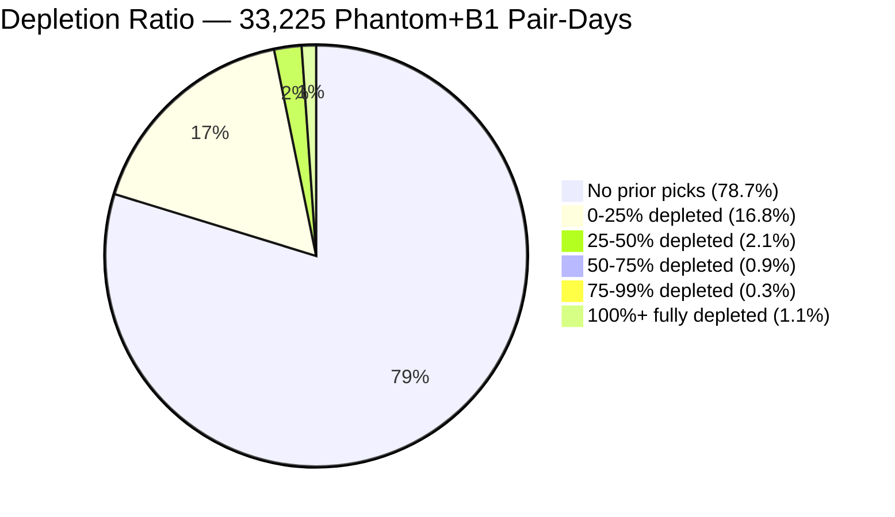
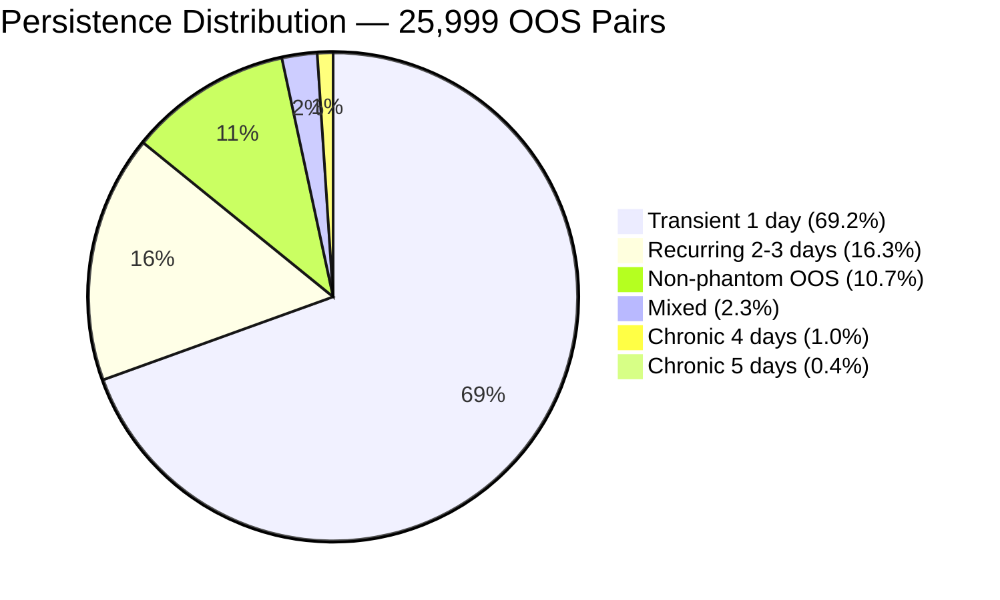
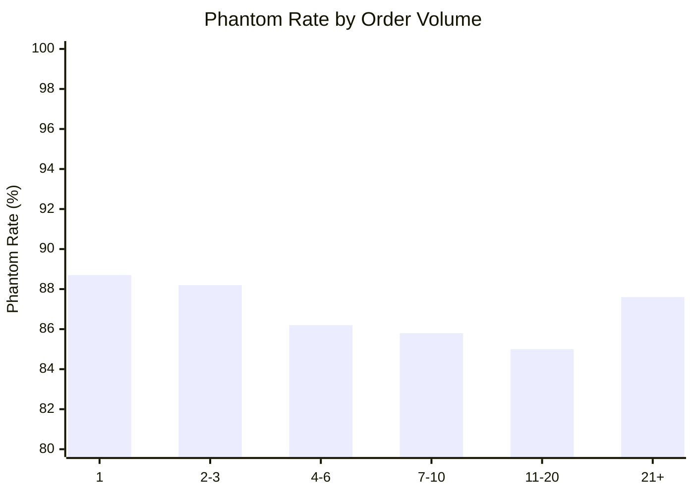
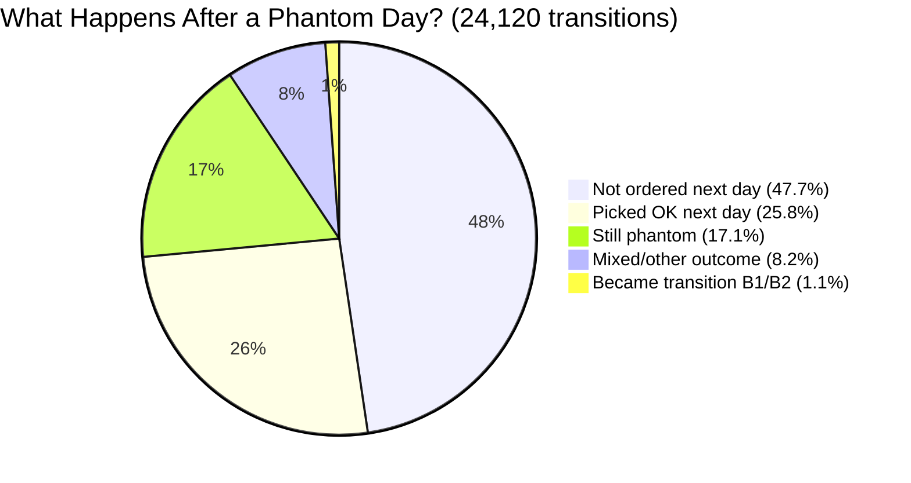

# Longitudinal Phantom OOS Analysis

> **Period:** Aug 11-20, 2026 (5 clean analysis days: Aug 11, 12, 15, 19, 20)
> **Scope:** 1.92M order lines, 49,779 OOS lines, 25,999 unique (SKU, store) pairs
> **Generated:** 2026-08-28

---

## Executive Summary

Phantom OOS occurs when the system shows stock available (PUBLICADOR = PUBLICAR, qty > 0) but the picker finds an empty shelf. This analysis tracks phantom items **across 5 days** to understand persistence, root cause, and store-type differences.

| Finding | Detail |
|---------|--------|
| **Depletion is NOT the main cause** | Only 1.1% of phantom cases were depleted by prior picked orders. 78.7% had zero prior picks. |
| **Mostly transient** | 18,000 of 23,207 phantom-ever pairs (77.6%) appear on only 1 day. Only 17.1% persist day-to-day. |
| **Dark stores dominate volume, not rate** | Phantom rate is near-identical (DARK 89.4% vs REGULAR 89.0%), but dark stores have 3.3x the CLP exposure. |
| **Stacking doesn't explain it** | Phantom rate is 85-89% across all volume buckets — high-demand SKUs aren't more phantom. |
| **Root cause: shelf-level discrepancy** | HANA/PUBLICADOR reports stock, but physical shelf is empty. This is a store operations problem, not a pipeline problem. |

---

## 1. Intra-Day Depletion Analysis

**Hypothesis:** Customers (ecommerce or walk-in) pick the item before the picker arrives, depleting stock between the PUBLICADOR snapshot and the picking window.

### Results

| Metric | Value |
|--------|-------|
| Total phantom+B1 pair-days analyzed | 33,225 |
| With prior picked orders (same SKU+store, same day) | 7,937 (23.9%) |
| Fully depleted (prior picks >= PUBLICADOR qty) | 362 (1.1%) |

### Depletion Ratio Distribution

### Per-Day Breakdown

| Day | Pair-Days | With Prior Picks | Fully Depleted | Avg Ratio |
|-----|----------:|-----------------:|---------------:|----------:|
| Aug 11 | 6,841 | 1,476 (21.6%) | 79 (1.2%) | 0.07 |
| Aug 12 | 5,874 | 1,196 (20.4%) | 55 (0.9%) | 0.05 |
| Aug 15 | 8,747 | 2,743 (31.4%) | 125 (1.4%) | 0.07 |
| Aug 19 | 5,811 | 1,211 (20.8%) | 44 (0.8%) | 0.04 |
| Aug 20 | 5,952 | 1,311 (22.0%) | 59 (1.0%) | 0.04 |

**Conclusion:** Prior ecommerce order depletion explains < 2% of phantom OOS. The vast majority of phantom items had **no prior orders at all** — the shelf was already empty when the first order came in, despite PUBLICADOR reporting stock.

---

## 2. Cross-Day Persistence

**Question:** Are phantom items chronic (same SKU+store failing every day) or transient (one-off shelf gaps)?

### Persistence Classification

| Persistence | Pairs | % | OOS CLP (M) | Description |
|-------------|------:|--:|-----------:|-------------|
| **CHRONIC (5 days)** | 91 | 0.4% | 7.4 | Phantom every single analysis day |
| **CHRONIC (4 days)** | 269 | 1.0% | 12.1 | Phantom on 4 of 5 days |
| **RECURRING (2-3 days)** | 4,244 | 16.3% | 89.4 | Phantom on 2-3 days |
| **TRANSIENT (1 day)** | 18,000 | 69.2% | 122.9 | Phantom on exactly 1 day |
| **MIXED** | 603 | 2.3% | 12.3 | Phantom some days, other OOS category on others |
| **NON-PHANTOM OOS** | 2,792 | 10.7% | 23.4 | Never phantom (B1/B2/C/D only) |

### Top 10 Chronic Phantom Pairs (by CLP exposure)

| SKU | Store | Type | Days | OOS CLP | Pattern (Aug 11→20) |
|-----|-------|------|-----:|--------:|---------------------|
| 1996518 | J411 | DARK | 4 | 556K | A0 → A1 → A0 → mixed → A0 |
| 506862 | J411 | DARK | 4 | 466K | A0 → A0 → A0 → mixed → A0 |
| 1580859 | J403 | DARK | 4 | 336K | OK → A0 → A0 → A0 → A0 |
| 2025718 | J403 | DARK | 5 | 284K | A0 → A0 → A0 → A0 → A0 |
| 261284 | J512 | DARK | 5 | 276K | A0 → A1 → A1 → A0 → A0 |
| 940744 | J411 | DARK | 4 | 265K | A0 → A0 → mixed → A0 → A0 |
| 1930363 | J512 | DARK | 5 | 233K | A0 → A0 → A0 → A0 → A0 |
| 1977549 | J414 | DARK | 5 | 231K | A0 → A0 → A0 → A0 → A0 |
| 693559 | J512 | DARK | 5 | 214K | A0 → A0 → A0 → A0 → A0 |
| 506862 | J534 | DARK | 5 | 210K | A0 → A0 → A0 → A0 → A0 |

> **All top 10 chronic pairs are dark stores.** These are persistent shelf discrepancies — HANA reports stock, but the shelf never actually has the item.

---

## 3. Order Stacking Correlation

**Hypothesis:** High-demand SKUs are more likely to go phantom because multiple orders deplete stock faster than PUBLICADOR can react.

### Stacking Volume vs Phantom Rate

| Orders/Day | Pair-Days | Phantom | Rate | OOS CLP (M) | Dark Rate | Regular Rate |
|-----------|----------:|--------:|-----:|-----------:|----------:|-------------:|
| 1 order | 15,679 | 13,907 | 88.7% | 98.1 | 89.1% | 87.8% |
| 2-3 orders | 9,109 | 8,038 | 88.2% | 66.1 | 88.3% | 88.2% |
| 4-6 orders | 3,948 | 3,402 | 86.2% | 35.5 | 86.4% | 85.5% |
| 7-10 orders | 1,904 | 1,634 | 85.8% | 20.1 | 85.2% | 88.2% |
| 11-20 orders | 1,524 | 1,295 | 85.0% | 20.5 | 83.3% | 92.4% |
| 21+ orders | 1,424 | 1,248 | 87.6% | 27.2 | 85.9% | 97.2% |

**Conclusion:** Phantom rate is **flat across all volume buckets** (85-89%). Order stacking does not significantly increase the likelihood of phantom OOS. Even single-order SKUs are phantom 88.7% of the time. This confirms the problem is at the shelf/inventory accuracy level, not demand-driven depletion.

> Note: regular stores at 21+ orders show 97.2% phantom rate — these are high-demand items in stores with walk-in traffic, suggesting physical customers may contribute to depletion in the highest-volume segment only.

---

## 4. Dark Store vs Regular Store

**Hypothesis:** Dark stores (J4xx/J5xx — no walk-in customers) should have lower phantom rates since there's no competing physical traffic.

### Side-by-Side Comparison

| Metric | Dark Store | Regular Store |
|--------|----------:|-------------:|
| Unique OOS pairs | 18,104 | 7,895 |
| Phantom pairs (>=1 day) | 16,183 | 7,024 |
| **Phantom rate** | **89.4%** | **89.0%** |
| Chronic (4-5 days) | 303 | 57 |
| Recurring (2-3 days) | 3,237 | 1,007 |
| Transient (1 day) | 12,187 | 5,813 |
| OOS CLP (M) | 204.6 | 62.9 |
| Depletion cases | 23,770 | 9,455 |
| With prior picked orders | 6,120 (25.7%) | 1,817 (19.2%) |
| Fully depleted | 308 (1.3%) | 54 (0.6%) |
| Avg depletion ratio | 0.07 | 0.03 |

### Key Insight

Phantom rate is **virtually identical** between dark and regular stores. This **disproves the shared-inventory hypothesis** as the primary driver — if walk-in customers were depleting stock, regular stores should have much higher phantom rates than dark stores.

The difference is in **volume**: dark stores generate 2.3x more OOS pairs and 3.3x more CLP exposure. This is because dark stores handle higher ecommerce order density, so more items are exposed to the phantom problem.

Dark stores do show slightly higher depletion ratios (0.07 vs 0.03) and more prior-pick cases (25.7% vs 19.2%), consistent with higher ecommerce throughput, but the effect is marginal.

---

## 5. Status Transitions

**Question:** When an item is phantom on Day N, what happens on Day N+1?

### Transition Matrix (Phantom-Ever Pairs Only)

| From \ To | PHANTOM | PICKED OK | NOT ORDERED | TRANSITION | OTHER |
|-----------|--------:|----------:|------------:|-----------:|------:|
| **PHANTOM** (24,120) | **4,136 (17.1%)** | 6,232 (25.8%) | 11,498 (47.7%) | 272 (1.1%) | 1,982 (8.2%) |
| **PICKED OK** (21,216) | 5,997 (28.3%) | 9,478 (44.7%) | 4,589 (21.6%) | 135 (0.6%) | 1,017 (4.8%) |
| **NOT ORDERED** (41,579) | 11,251 (27.1%) | 5,110 (12.3%) | 23,904 (57.5%) | 151 (0.4%) | 1,163 (2.8%) |
| **TRANSITION** (769) | 274 (35.6%) | 151 (19.6%) | 212 (27.6%) | 87 (11.3%) | 45 (5.9%) |

### Phantom Day-to-Day Outcomes

### Interpretation

- **47.7% → NOT ORDERED**: The item simply wasn't ordered the next day. Demand is sporadic — phantom exposure depends on whether anyone orders it.
- **25.8% → PICKED OK**: Self-resolved. Stock came back (likely restocked overnight or between analysis days). No intervention needed.
- **17.1% → Still PHANTOM**: Persistent shelf gap. HANA continues to report stock that doesn't exist on the shelf. These are the **actionable** pairs for store operations.
- **1.1% → TRANSITION**: Stock actually ran out between PUBLICADOR batches. Organic depletion.

---

## 6. Root Cause Summary

| Cause | Evidence | Impact | Owner |
|-------|----------|--------|-------|
| **Shelf-level inventory inaccuracy** | 89% phantom rate identical across dark and regular stores; 78.7% have zero prior picks | 85% of OOS lines | Store Operations |
| **Organic stock depletion (B1)** | B1_TRANSITION: stock ran out between PUB batches | 12-15% of OOS lines | Unavoidable |
| **Ecommerce order depletion** | 1.1% fully depleted by prior picks | < 2% of OOS lines | Minor factor |
| **Pipeline delay (B2+C)** | PUBLICADOR blocked or delayed | 0.3-0.5% of OOS lines | PUBLICADOR→VTEX Pipeline |

### Recommendations

1. **Cycle count program for chronic pairs** — The 360 chronic phantom pairs (4-5 day persistence) should trigger automatic cycle count requests. These are items where HANA consistently overestimates on-hand stock.

2. **Dark store audit** — Dark stores generate 3.3x the CLP exposure despite similar phantom rates. Given their higher order density, improving inventory accuracy in dark stores has outsized ROI (204.6M CLP/5 days = ~41M CLP/day at risk).

3. **Threshold-based safety stock** — For the 4,244 recurring phantom pairs (2-3 days), consider reducing the PUBLICAR threshold: if HANA qty < N, flag as NO PUBLICAR. Current system publishes even at qty=1, which is not enough safety margin for items with shelf discrepancies.

4. **Pipeline delay is negligible** — B2+C is 0.3-0.5% of OOS lines. The PUBLICADOR→VTEX propagation pipeline is not the primary problem.

---

## Methodology

**Data sources per day:**
- `orders_{tag}.csv` — All order lines from Redshift (status, quantity, timing, CLP)
- `oos_classification_{tag}.csv` — Each OOS line classified against PUBLICADOR batches

**Key definitions:**
- **Phantom (A0):** PUBLICAR all day, qty > 0. System says in stock, picker finds empty shelf.
- **B1 Transition:** Stock ran out between PUBLICADOR batches. Published at order time, unpublished later.
- **Depletion ratio:** Sum of prior picked quantities / PUBLICADOR reported qty at OOS time.
- **Dark store:** J4xx, J5xx store codes (dedicated ecommerce fulfillment, no walk-in customers).
- **Persistence:** Count of analysis days where the (SKU, store) pair was classified as phantom.

**Script:** `scripts/longitudinal_phantom.py` — Two-pass filtered loading (26K target pairs from 1.92M order lines), 5 analytical modules, CSV + console output.

**Limitations:**
- 5 non-consecutive days (gaps at Aug 13-14, 16-18) — transition analysis labels gap sizes
- Walk-in customer sales not captured in Redshift order data — depletion analysis covers ecommerce orders only
- PUBLICADOR updates 8x/day with overnight gap (11PM-7AM) — stock changes within this window are unobserved
