# OOS  — Master Report

> **Period**: Aug 11, 12, 15, 19, 20 (2026) — 5 clean analysis days
> **Excluded**: Aug 13-14 (Spark/PUBLICADOR outage)
> **Date analyzed**: 2026-08-25
> **Script**: `scripts/classify_oos.py`

---

## 1. Data Sources

| Source | Description | Per Day |
|--------|-------------|---------|
| **Orders** | Redshift `jumbo_bo.io_items` + `vw_master_pickers_data` | 340-495K lines |
| **PUBLICADOR** | S3 CSV files, semicolon-delimited, ~1.19M rows each | 18 files |
| **VTEX Events** | SQS drain JSONL (for future pipeline delay measurement) | 3-14M events |
| **SKU Mapping** | `vtex_sap_mapping.csv` (dim_surtidos) — VTEX skuId to SAP refid | 74,804 rows |

### PUBLICADOR S3 Upload Schedule

PUBLICADOR generates CSV snapshots from SAP/HANA data. Each file contains ~1.19M (item, store) pairs with stock quantities and publish/block decisions.

```mermaid
gantt
    title PUBLICADOR S3 Uploads — Daily Pattern (CLT)
    dateFormat HH:mm
    axisFormat %H:%M
    section Prev Evening
    lt2341 (×4 re-push)   :done, 03:43, 06:43
    section Hourly Batches
    lt0640                :active, 07:42, 08:42
    lt0740                :active, 08:43, 09:43
    lt0841                :active, 09:42, 10:42
    lt0940                :active, 10:43, 11:43
    lt1040                :active, 11:43, 12:43
    lt1141                :active, 12:42, 13:42
    lt1240                :active, 13:43, 14:43
    lt1341                :active, 14:42, 15:42
    lt1441                :active, 15:42, 16:42
    lt1540                :active, 16:43, 17:43
    lt1641                :active, 17:42, 18:42
    lt1740                :active, 18:43, 19:43
    lt1841                :active, 19:43, 20:43
    section Overnight Gap
    No uploads             :crit, 20:43, 03:43
```

```
Files/day:  18 (1 previous evening × 4 re-pushes + 13 hourly + 1 evening)
Window:     03:43 CLT (overnight re-push) → 19:43 CLT (last batch)
Gap:        19:43 → 03:43 (8-hour overnight gap, no new data)
Timing:     PUBLICADOR Load_Time + ~62 min = S3 upload time
```

---

## 2. Order Volume & Status Breakdown

### 5-Day Aggregate (1,921,770 lines)

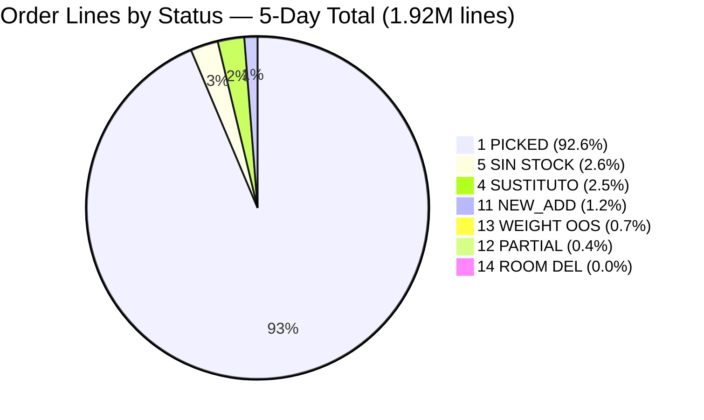

| Status | Name | Lines | % | CLP (M) | Included in OOS? |
|-------:|------|------:|--:|--------:|:----------------:|
| **1** | PICKED | 1,779,624 | 92.6% | 8,105.2 | No |
| **5** | VALIDATE_NO_STOCK | 49,598 | 2.6% | 257.3 | **Yes** |
| **4** | VALIDATE_SUSTITUTE | 47,640 | 2.5% | 241.6 | No |
| **11** | NEW_ADD | 23,590 | 1.2% | 115.9 | No (excluded) |
| **13** | FREE_PICKING_VALIDATE | 12,802 | 0.7% | 198.4 | Flagged |
| **12** | PARTIAL_ADD_VALIDATE | 8,335 | 0.4% | 76.2 | No |
| **14** | ROOM_DELETION | 181 | 0.0% | 0.2 | **Yes** |

**Formulas:**
- **OOS Rate** = (status 5 + 14) / total lines
- **Found Rate** = status 1 / (total - status 11) — status 11 excluded since picker-added items aren't customer orders
- **Status 13** is effectively OOS (pickingqty=0) but uses a separate code for weight items. 12,802 lines (198.4M CLP) flagged but not classified.

---

## 3. Multi-Day Summary

| Day | Lines | Orders | Stores | Revenue (M) | OOS Lines | OOS Rate | Found Rate |
|-----|------:|-------:|-------:|------------:|----------:|---------:|---------:|
| Aug 11 | 361,215 | 22,145 | 34 | 1,676.9 | 10,737 | 2.97% | 93.33% |
| Aug 12 | 343,503 | 21,267 | 34 | 1,606.2 | 8,875 | 2.58% | 94.19% |
| Aug 15 | 495,287 | 27,628 | 33 | 2,149.3 | 13,518 | 2.73% | 93.85% |
| Aug 19 | 341,809 | 21,422 | 36 | 1,635.1 | 8,187 | 2.40% | 94.34% |
| Aug 20 | 379,956 | 22,992 | 36 | 1,817.3 | 8,462 | 2.23% | 94.72% |
| **Total** | **1,921,770** | **115,454** | | **8,884.8** | **49,779** | **2.59%** | **94.11%** |

> Aug 15 is the largest day (Friday effect — 37% more orders than average).

### OOS Rate Trend

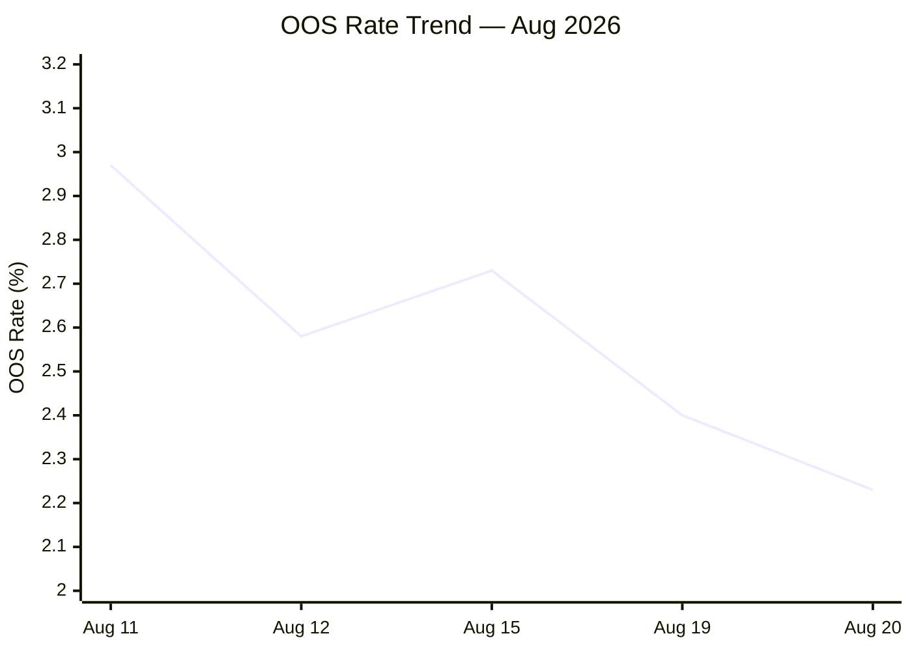

### Found Rate Trend

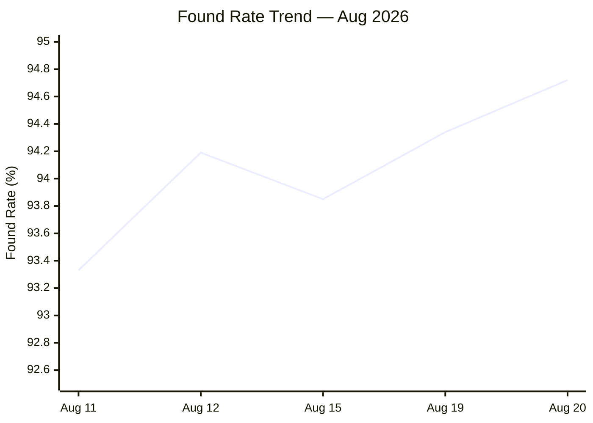

### Order Volume by Day

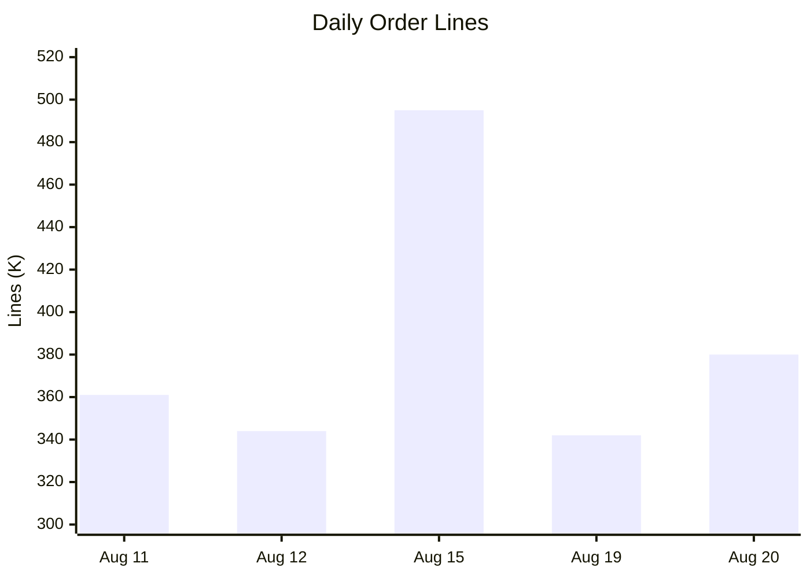

---

## 4. Customer Impact — Order Level

### Order Outcome Profile

Not all orders are affected equally. Most orders deliver successfully; OOS impacts a subset.

| Outcome | Aug 11 | Aug 12 | Aug 15 | Aug 19 | Aug 20 |
|---------|-------:|-------:|-------:|-------:|-------:|
| **Perfect** (100% picked) | 43.6% | 48.1% | 42.6% | 49.2% | 50.5% |
| Substitution only | 18.9% | 17.7% | 18.9% | 17.3% | 16.3% |
| OOS only (no sub) | 21.3% | 20.1% | 21.6% | 18.9% | 18.2% |
| OOS + substitution | 10.4% | 8.4% | 10.3% | 7.5% | 7.2% |
| Other (partial/weight) | 5.8% | 5.8% | 6.6% | 7.2% | 7.7% |

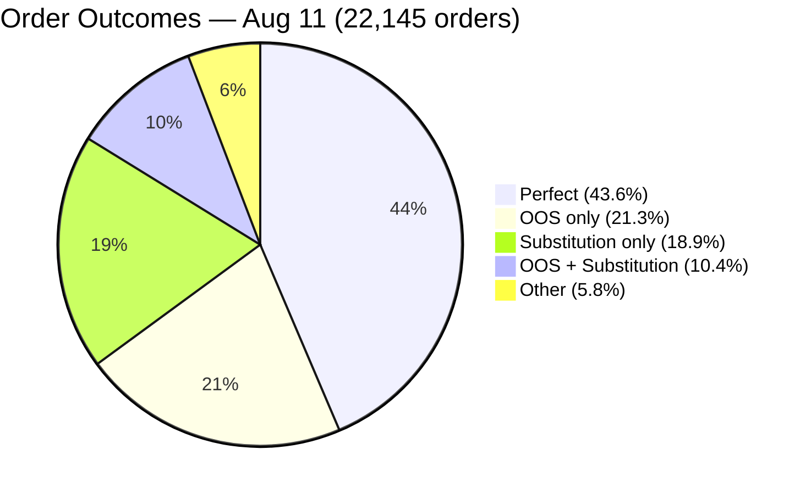

### OOS-Affected Orders

| Metric | Aug 11 | Aug 12 | Aug 15 | Aug 19 | Aug 20 |
|--------|-------:|-------:|-------:|-------:|-------:|
| Total orders | 22,145 | 21,267 | 27,628 | 21,422 | 22,992 |
| OOS-affected orders | 7,025 | 6,053 | 8,803 | 5,658 | 5,847 |
| **% affected** | **31.7%** | **28.5%** | **31.9%** | **26.4%** | **25.4%** |
| Avg items/order | 21.4 | 21.6 | 22.8 | 21.2 | 22.0 |
| Avg OOS items/order | 1.5 | 1.5 | 1.5 | 1.4 | 1.4 |
| **Avg % OOS per order** | **7.1%** | **6.8%** | **6.7%** | **6.8%** | **6.6%** |

### OOS Severity per Order

| Severity | Aug 11 | Aug 12 | Aug 15 | Aug 19 | Aug 20 |
|----------|-------:|-------:|-------:|-------:|-------:|
| 1 OOS item | 66.8% | 69.8% | 66.5% | 71.1% | 70.9% |
| 2+ OOS items (< 50%) | 32.9% | 29.9% | 33.3% | 28.6% | 28.8% |
| 50-99% OOS | 0.6% | 0.5% | 0.4% | 0.4% | 0.4% |
| 100% wipeout | 0.2% | 0.2% | 0.1% | 0.2% | 0.1% |

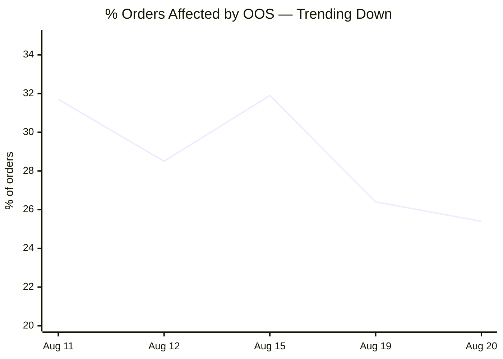

> **Typical impact**: 1 out of ~22 items missing. 67-71% of affected orders have only 1 missing item. Total wipeouts (100% OOS) are 7-17 per day (0.1-0.2%). Items confirmed not delivered: `pickingqty = 0` for all 49,779 OOS lines.

---

## 5. Classification Algorithm (PUBLICADOR-Based)

### Question

For each OOS order line (status 5 or 14): **why did the customer see this item as in-stock on jumbo.cl?**

### Join Key

```
Orders refid:  "382413-KG"   → strip -KG/-PAK/-CS → "382413"
PUB Item_Id:   "382413"      → direct match
Store:         id_tienda "J411" = PUB Location_Id "J411"
```

### Flowchart

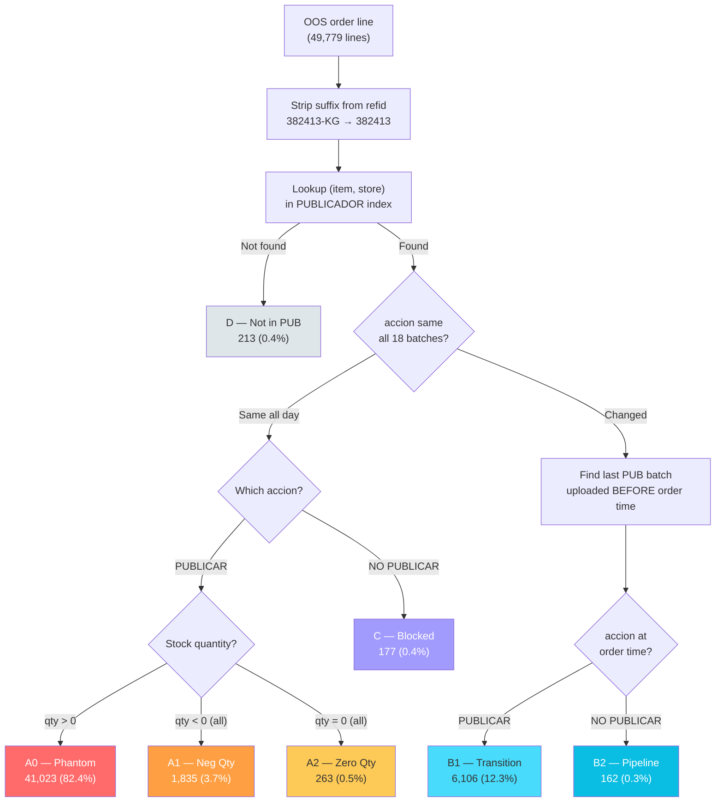

---

## 6. Classification Categories

### A0 — Phantom Inventory (82.4% of OOS)

PUBLICADOR says PUBLICAR with positive stock **all day**. VTEX correctly shows item in-stock. Customer orders. But the physical shelf is empty.

| Example | refid | Store | Order Time | PUB qty | caso |
|---------|-------|-------|------------|--------:|------|
| Agua de Colonia Barzelatto 500 cc | 273608 | J955 | 00:25 | 12 | JERARQUIA CON STOCK REGULAR |
| Summer Mix Dole 150 g | 920715 | J955 | 00:25 | 4 | REGLA DDS |

### A1 — Phantom Negative Qty (3.7%)

PUBLICADOR says PUBLICAR despite **negative** stock in every batch.

| Example | refid | Store | Order Time | PUB qty | caso |
|---------|-------|-------|------------|--------:|------|
| Pan Marraqueta Wholegrain Granel | 1962049-KG | J592 | 00:53 | -0.5 | LISTADO FIJO SIN STOCK |
| Ramo de Mini Rosas 6 un. | 989736 | J403 | 00:53 | -86 | PRODUCTO TIENDA MADRE |

### A2 — Phantom Zero Qty (0.5%)

PUBLICADOR says PUBLICAR despite **zero** stock in every batch.

| Example | refid | Store | Order Time | PUB qty | caso |
|---------|-------|-------|------------|--------:|------|
| Palta Reina 1 un. | 1359541 | J760 | 06:31 | 0 | LISTADO FIJO SIN STOCK |
| Croissant Cuisine & Co 3 un. | 2018277 | J410 | 08:59 | 0 | PRODUCTO TIENDA MADRE |

### B1 — Transition, PUBLICAR at Order (12.3%)

Item's accion **changed** during the day. At order time, the latest PUBLICADOR batch still said PUBLICAR.

| Example | refid | Store | Order Time | PUB qty | caso |
|---------|-------|-------|------------|--------:|------|
| Chuleta Centro Cong Super Cerdo 750 G | 1712073 | J521 | 00:13 | 4 | JERARQUIA PRODUCCION |
| Agua Saborizada Benedictino Manzana 1.5 L | 1820043 | J760 | 00:01 | 19 | JERARQUIA PRODUCCION |

### B2 — Transition, NO PUBLICAR at Order (0.3%)

PUBLICADOR had **already** sent NO PUBLICAR before the order, but the customer was still able to order. Possible pipeline propagation delay.

| Example                               | refid      | Store | Order Time | PUB qty | caso                        |
| ---------------------------------------| ------------| -------| ------------| --------:| -----------------------------|
| Yogurt Soprole Proteina Natural 155 g | 1775576005 | J775  | 00:42      | -28     | JERARQUIA CON STOCK REGULAR |
| Rucula Vegus Organica 200 g           | 728565     | J512  | 08:44      | 0       | REGLA DDS                   |

### C — Blocked All Day, VTEX Stale (0.4%)

PUBLICADOR said NO PUBLICAR in **every** batch all day. VTEX never processed the block.

| Example | refid | Store | Order Time | PUB qty | caso |
|---------|-------|-------|------------|--------:|------|
| Chocolates Rolls Crispy 100 g | 1926388 | J408 | 10:44 | 20 | PRODUCTO TIENDA MADRE |
| Saborizante Cola Cao Chocolate 400 g | 265912 | J411 | 13:48 | 0 | JERARQUIA CON STOCK REGULAR |

### D — Not in PUBLICADOR (0.4%)

Item+store pair not found in any of the 18 PUBLICADOR batches. New items or catalog gaps.

| Example | refid | Store | Order Time |
|---------|-------|-------|------------|
| Palta Hass Pote 2 un. | 2032557 | J988 | 16:58 |
| Hummus Perfect Choice Tradicional 220 g | 1838040 | J411 | 16:49 |

---

## 7. Results by Day

### Classification Counts

| Category | Aug 11 | Aug 12 | Aug 15 | Aug 19 | Aug 20 | Total |
|----------|-------:|-------:|-------:|-------:|-------:|------:|
| A0 Phantom | 8,716 | 7,196 | 11,168 | 6,831 | 7,112 | 41,023 |
| A1 Neg Qty | 380 | 369 | 485 | 301 | 300 | 1,835 |
| A2 Zero Qty | 33 | 31 | 46 | 69 | 84 | 263 |
| B1 Transition | 1,569 | 1,218 | 1,479 | 912 | 928 | 6,106 |
| B2 Pipeline | 27 | 24 | 56 | 43 | 12 | 162 |
| C Blocked | 7 | 19 | 117 | 24 | 10 | 177 |
| D Not in PUB | 5 | 18 | 167 | 7 | 16 | 213 |
| **Total OOS** | **10,737** | **8,875** | **13,518** | **8,187** | **8,462** | **49,779** |

### Per-Day Classification Charts

#### Aug 11 (10,737 OOS lines)


#### Aug 12 (8,875 OOS lines)

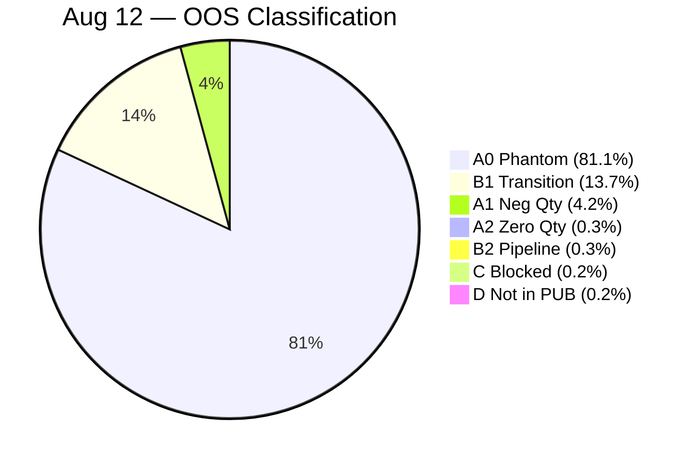

#### Aug 15 (13,518 OOS lines)

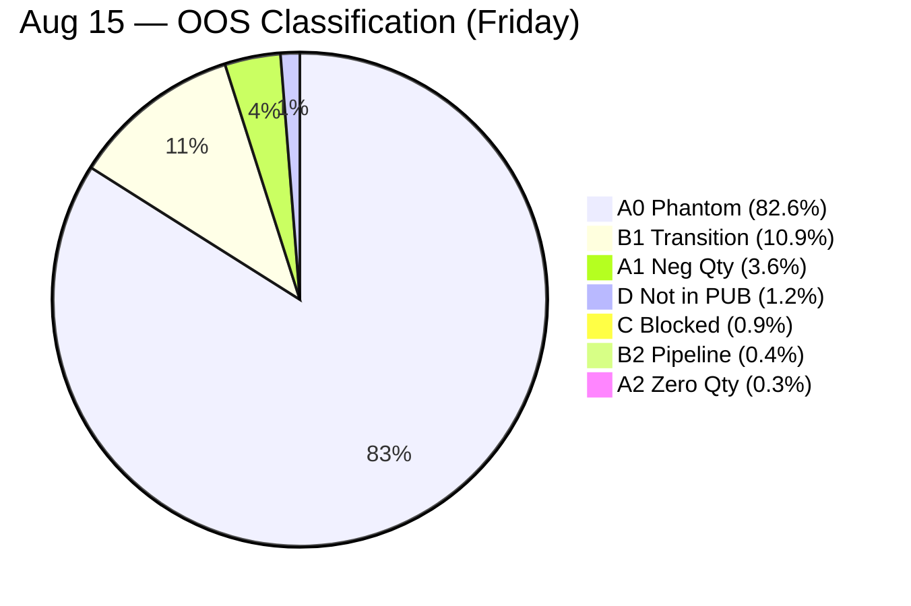

#### Aug 19 (8,187 OOS lines)

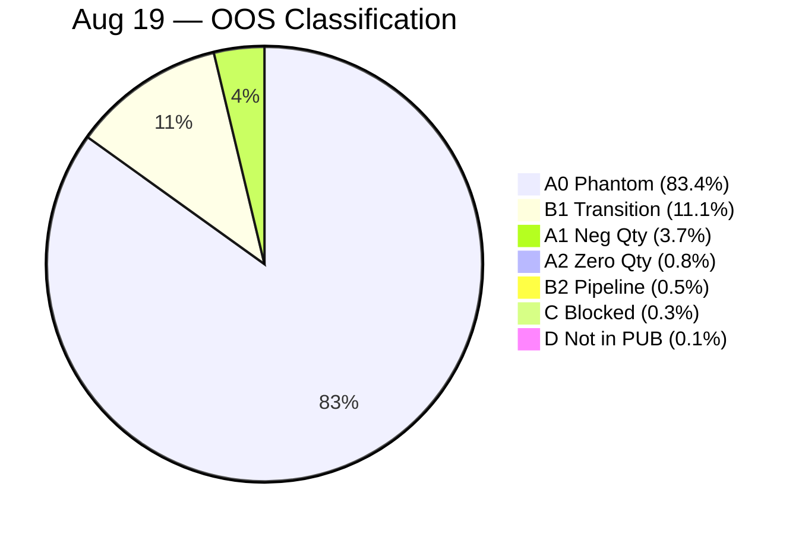

#### Aug 20 (8,462 OOS lines)


### Responsibility Split

| Responsibility | Aug 11 | Aug 12 | Aug 15 | Aug 19 | Aug 20 | Avg |
|----------------|-------:|-------:|-------:|-------:|-------:|----:|
| Phantom (store) | 85.0% | 85.6% | 86.5% | 88.0% | 88.6% | **86.6%** |
| Depletion (unavoidable) | 14.6% | 13.7% | 10.9% | 11.1% | 11.0% | **12.3%** |
| Pipeline delay (GIV) | 0.3% | 0.5% | 1.3% | 0.8% | 0.3% | **0.7%** |
| Catalog gap | 0.0% | 0.2% | 1.2% | 0.1% | 0.2% | **0.4%** |

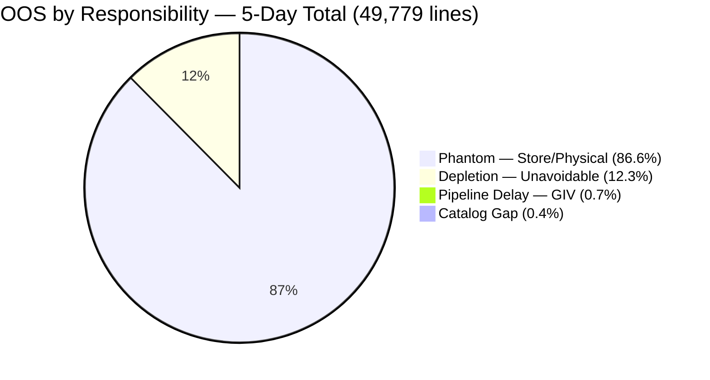

### Phantom Rate Trend (% of OOS that is Phantom)

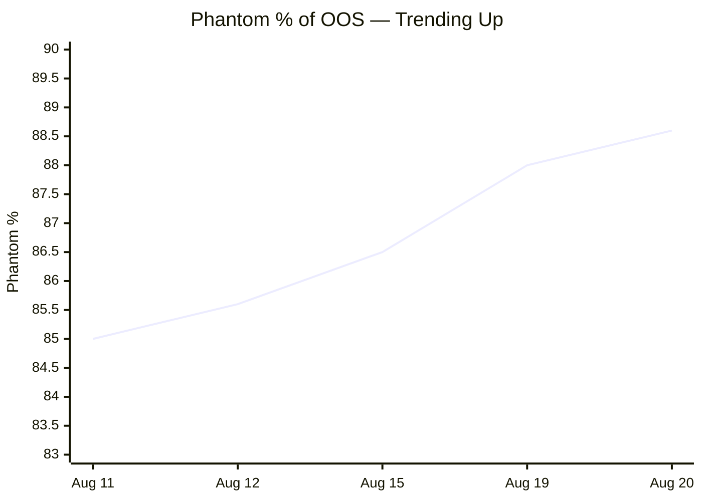

### OOS Lines by Day (Stacked by Category)

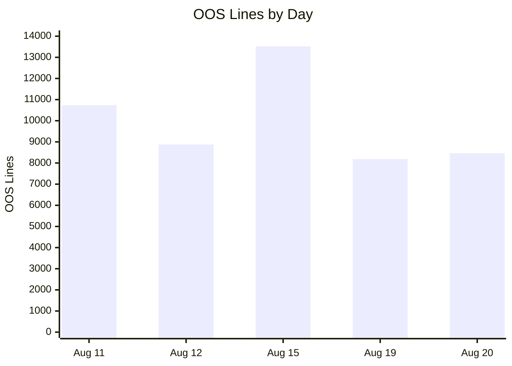

---

## 8. Top Phantom Items Across All Days

| Item | refid | Total CLP (K) | OOS Lines | Days |
|------|-------|-------------:|----------:|-----:|
| Uva Verde Granel | 1580859-KG | 2,112 | 240 | 5/5 |
| Carne Molida Vacuno 4% Grasa 500 g | 1998017 | 2,058 | 161 | 5/5 |
| Carne Molida Congelada 4% Cuisine & Co | 2073560 | 1,906 | 153 | 4/5 |
| Palta Hass Extra Chilena (2 un.) | 506862-KG | 1,703 | 351 | 5/5 |
| Carne Molida Vacuno 7% Grasa 500 g | 1998019 | 1,372 | 116 | 5/5 |
| Reineta Filete Fresca Granel | 436869-KG | 1,165 | 69 | 5/5 |
| Punta de Ganso Al Vacio kg | 1462107-KG | 921 | 37 | 5/5 |
| Posta Negra Desgrasada Bandeja 750 g | 1998537-KG | 850 | 44 | 4/5 |
| Bistec de Asiento Bandeja 300 g | 1995694-KG | 841 | 86 | 4/5 |
| Frutilla Pote 300 g | 1497672 | 835 | 215 | 5/5 |

> Top offenders are **meat, produce, and fruit** — categories with high physical shrinkage and inventory count inaccuracy.

---

## 9. Key Findings

1. **87% of OOS is phantom inventory** — PUBLICADOR correctly instructs VTEX to show the item as in-stock (PUBLICAR + positive qty), but the physical shelf is empty. This is a store operations problem: system stock count does not match reality.

2. **Pipeline delay is negligible (<1%)** — Only 339 of 49,779 OOS lines (0.7%) are attributable to PUBLICADOR-to-VTEX propagation delay. The pipeline is not the bottleneck.

3. **~4% of phantoms have negative or zero stock** (A1 + A2) — PUBLICADOR publishes items despite stock_umb being negative or zero. These are PUBLICADOR rule issues: negative stock should trigger NO PUBLICAR. Fixing this would prevent ~2,098 OOS lines across 5 days.

4. **Status 13 is uncounted OOS** — 12,802 additional lines across 5 days with pickingqty=0 use status 13 instead of 5/14. These are weight items (meat, produce). Including them raises OOS rate by ~0.5-0.8pp per day.

5. **OOS rate is improving** — 2.97% (Aug 11) to 2.23% (Aug 20), consistent decline. Found rate improving in parallel (93.3% to 94.7%).

6. **Phantom rate is increasing** — While absolute OOS drops, the phantom share grows from 85.0% to 88.6%. As pipeline-related OOS gets fixed, store-level inventory accuracy becomes the dominant lever.

---

## 10. Output Files

| File | Description |
|------|-------------|
| `scripts/classify_oos.py` | Reusable classification script |
| `analysis/aug_analysis/{tag}/oos_classification_{tag}.csv` | Per-line classification (5 files) |
| `analysis/aug_analysis/{tag}/orders_{tag}.csv` | Full order lines (5 files) |
| `analysis/aug_analysis/{tag}/publicador/` | 18 PUBLICADOR CSV files per day |
